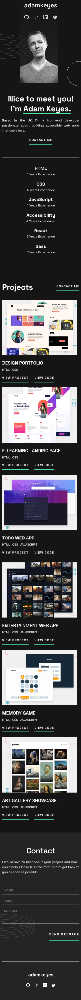

# Portafolio-responsive :computer: :iphone:

This is a new responsive project using the strategy "mobile first", HTML, Sass and JavaScript. It showcases the website of a full-stack developer. 

# Preview:

## Mobile:

## Tablet:

## Desktop:

### desktop active:

# Features :key:

1. The breakpoints are:
    - 432px for cellphones.
    - 768px for tablets.
    - 1440px for desktops.

2. Use of flex and grid for positioning.
3. Use of mixins for repeatable elements.
4. Use of variables for colors, fonts and sizes.
5. Aplication of Javascript for some hover effects.
6. Aplication of styles to form validations.

# Contributions :pencil2:

If you would like to make a contribution, add extra features to make the code better. it is always welcome.

Clone or fork the repository, create a new branch, and send me a pull request. 

***

# Portafolio-responsive :computer: :iphone:

Este es un proyecto responsive usando la estrategia "mobile first", HTML, Sass y JavaScript. Se muestra el website de un desarrollador. 

# Preview:

## Celular:

## Tablet:

## Computadora:

### Computadora active:

# Características :key:

1. Los breakpoints son:
    - 432px para celulares.
    - 768px para tablets.
    - 1440px para computadoras.

2. Uso de flex y grid para posicionamiento.
3. Uso de mixins para elementos repetidos. 
4. Uso de variables para colores, fuentes y tamaños.
5. Aplicación de JavaScript para crear algunos efectos al hacer :hover.
6. Aplicación de estilo a la validación de formulario.

# Contribuciones :pencil2:

Si te gustaría contribuir y añadir características extra para mejorar el código, es siempre bienvenido.

Clona o has un fork al repositorio, crea una nueva branch y luego mandame un pull request. 
